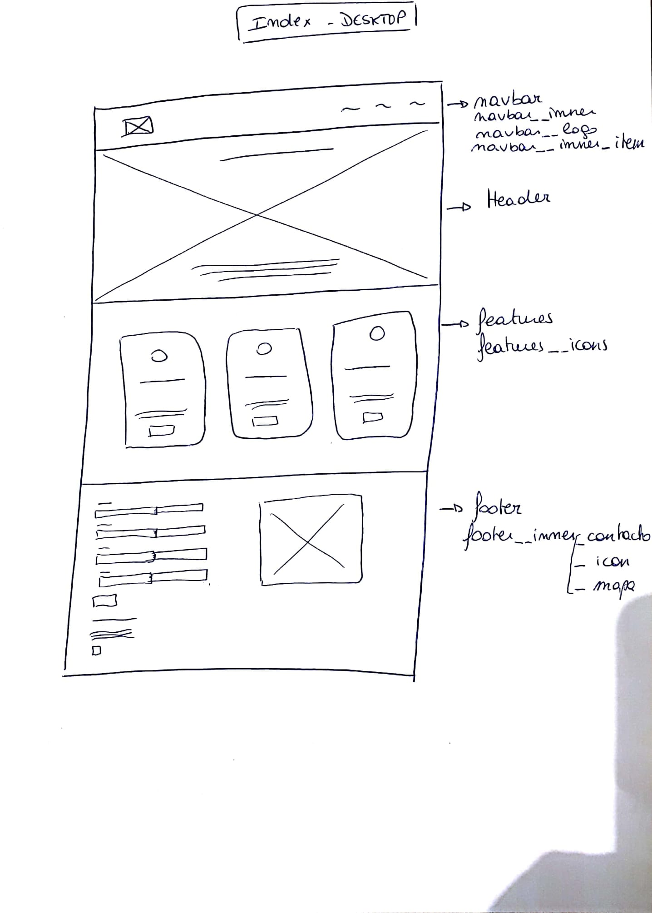
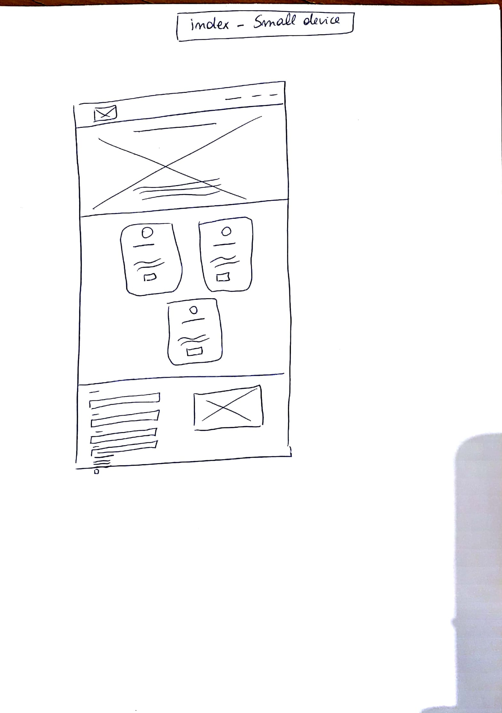
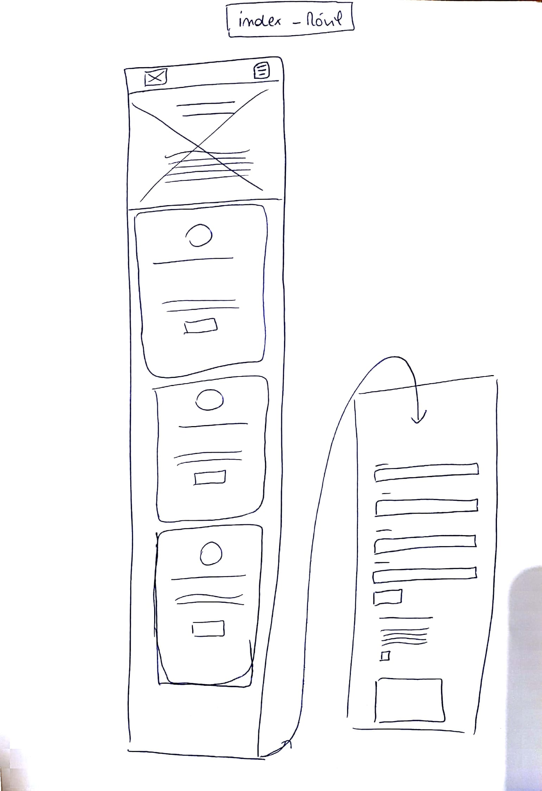
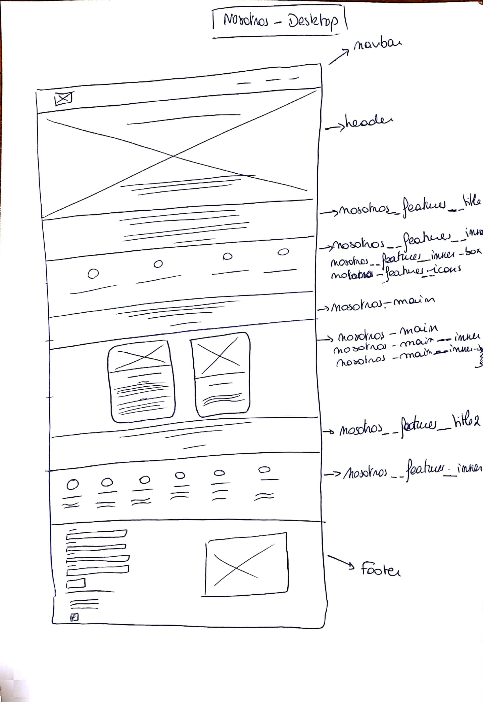
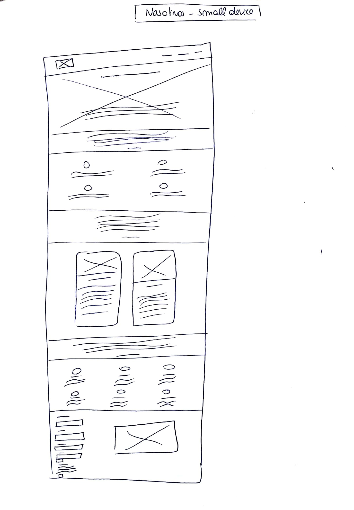
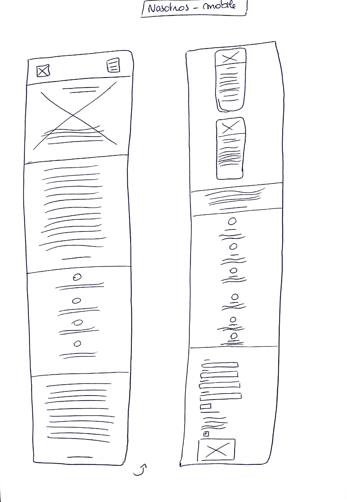
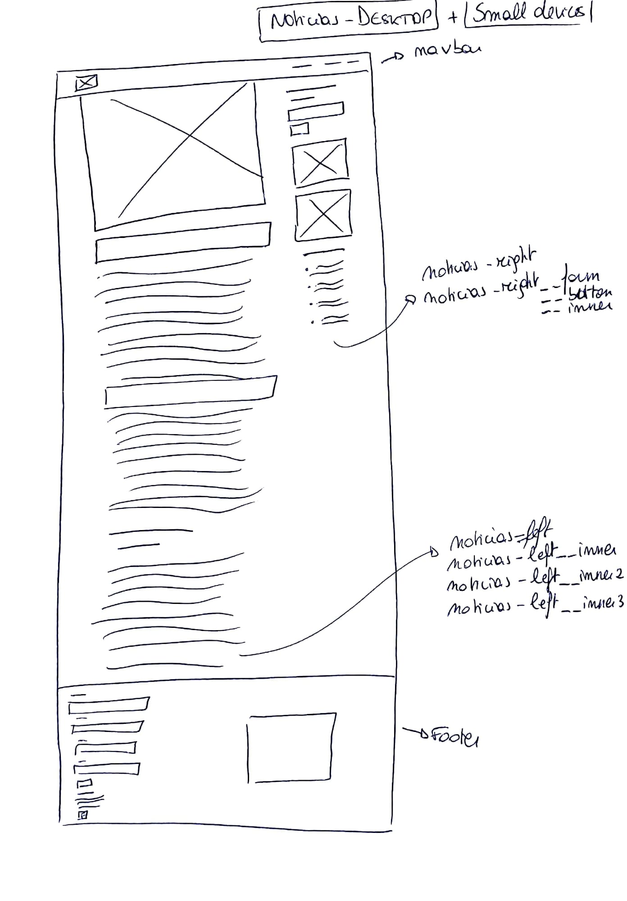
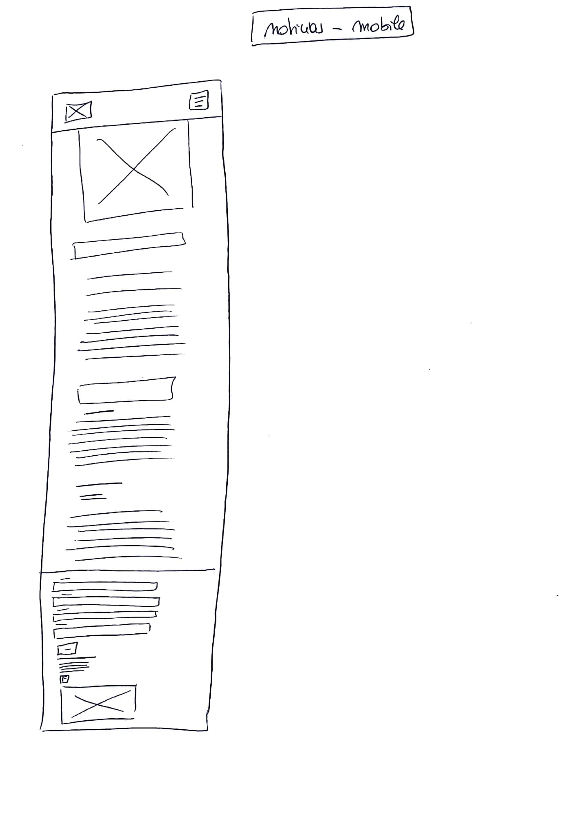

# MAQUETACIÓN
### Link GitHub Pages: https://magalibuisseret.github.io/PruebaG9_Magali/
### Requisitos generales:
La Fundación Niños y Cáncer requiere una versión mejorada de su sitio web.
El sitio contiene 3 páginas:
- Index: página informativa con la información principal de la empresa y los links
- Nosotros: página informativa sobre la historia, misión, actividades de la empresa
- Noticias: página tipo blog con las últimas noticias de la página
Cada página contiene: 
- Una barra de navegación con el logo y 3 items 
- Un footer con un formulario, los contactos de la empresa, el logo facebook y un mapa.
	
### Requisitos específicos:
	- Barra de navegación con logo y 3 items
		-*Usar bootstrap + Jquery 3.3.1*
	- Secciones con grilla 
		- *usar bootstrap*
	- Botones, form y frames
		- *usar bootstrap*

### Requisitos visuales:
	- En toda lás páginas:
		- Fuente: Roboto (google fonts)
		- Colores de texto: #CCCCCC, #FFFFFF, #15064A, white, black 
	- Imagenes:
		- Las imagenes se encuentran dentro de la carpeta assets/img
	- Iconos: 
		- Para buscar iconos, usar font awesome

### Sketch para desktop y mobile

